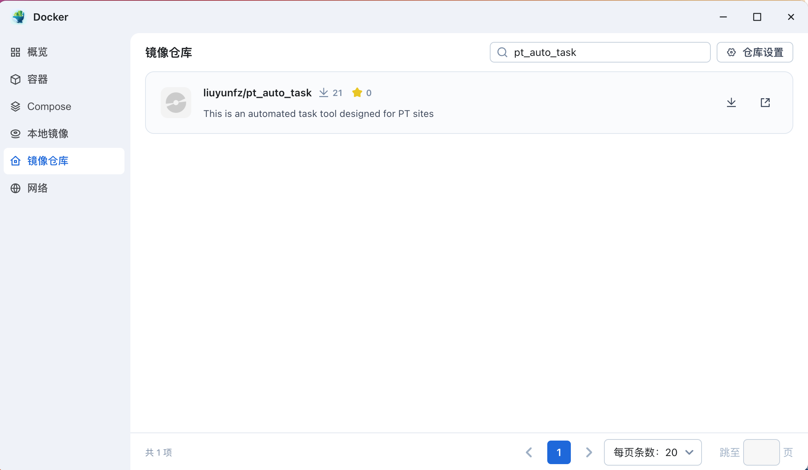
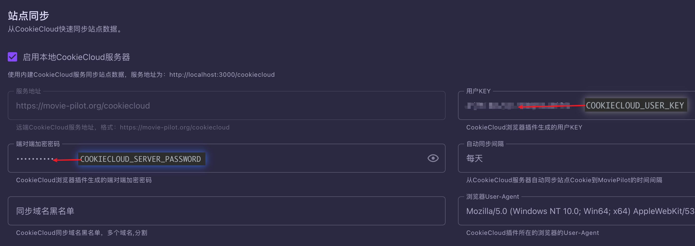

**本文是关于Docker镜像的使用方式教程**

## 方法一：可视化界面（以飞牛为例）

### 1. 拉取镜像
打开Docker应用程序，在镜像仓库中搜索`pt_auto_task`，找到`liuyunfz`开头的，点击下载（一般拉取latest标签即可）



> 如果遇到网络错误拉取失败可查看国内镜像站监控，更换可用的镜像服务 [https://status.1panel.top/status/docker](https://status.1panel.top/status/docker)

### 2. 创建容器

#### 2.1 创建容器
容器名称：随意取名，本处示例为`pt_auto_task`

资源限制：根据自己的需求设置，本处不进行设置使用自动  

开启自启动：可选，勾选后容器会在Docker启动时自动启动

#### 2.2 高级设置
端口设置：本程序无需开放端口，跳过

存储位置：本程序无需挂载目录，跳过（如有需要可将配置文件`/app/config_task.yml`挂载到宿主机）

环境变量：本程序需要设置4个环境变量，介绍如下
> 如果遇到容器自动添加的环境变量，可忽略，不影响使用
- `CRON_EXPRESSION`: 定时任务，为5位cron表达式，可按照需求设置，本处示例为`30 9,21 * * *`
- `COOKIECLOUD_SERVER_URL`: MP对应URL + /cookiecloud（即CookieCloud的服务器地址）
- `COOKIECLOUD_USER_KEY`: MP对应用户Key
- `COOKIECLOUD_SERVER_PASSWORD`: MP对应端对端加密密码




#### 2.3 启动容器
点击创建容器，等待容器启动完成即可，程序会在指定的时间自动执行任务


## 方法二：SSH命令行配置

### 1. 拉取镜像
使用以下命令从Docker Hub拉取镜像：
```sh
docker pull liuyunfz/pt_auto_task:latest
```

### 2. 创建并运行容器
使用以下命令创建并运行容器：
```sh
docker run -d \
  --name pt_auto_task \
  -e CRON_EXPRESSION="30 9,21 * * *" \
  -e COOKIECLOUD_SERVER_URL="your_cookiecloud_server_url" \
  -e COOKIECLOUD_USER_KEY="your_cookiecloud_user_key" \
  -e COOKIECLOUD_SERVER_PASSWORD="your_cookiecloud_server_password" \
  liuyunfz/pt_auto_task:latest
```
请将`your_cookiecloud_server_url`、`your_cookiecloud_user_key`和`your_cookiecloud_server_password`替换为实际的值。
具体环境变量介绍同上文[可视化创建中的高级设置](#22-高级设置)
### 3. 检查容器状态（可选）
以上docker容器就创建完成了，如果你需要查看容器日志可使用以下命令：
```sh
docker logs pt_auto_task
```

## Enjoy it

到此Docker的配置就结束了，如果需要通知订阅，只需额外设置青龙相关推送的环境变量即可