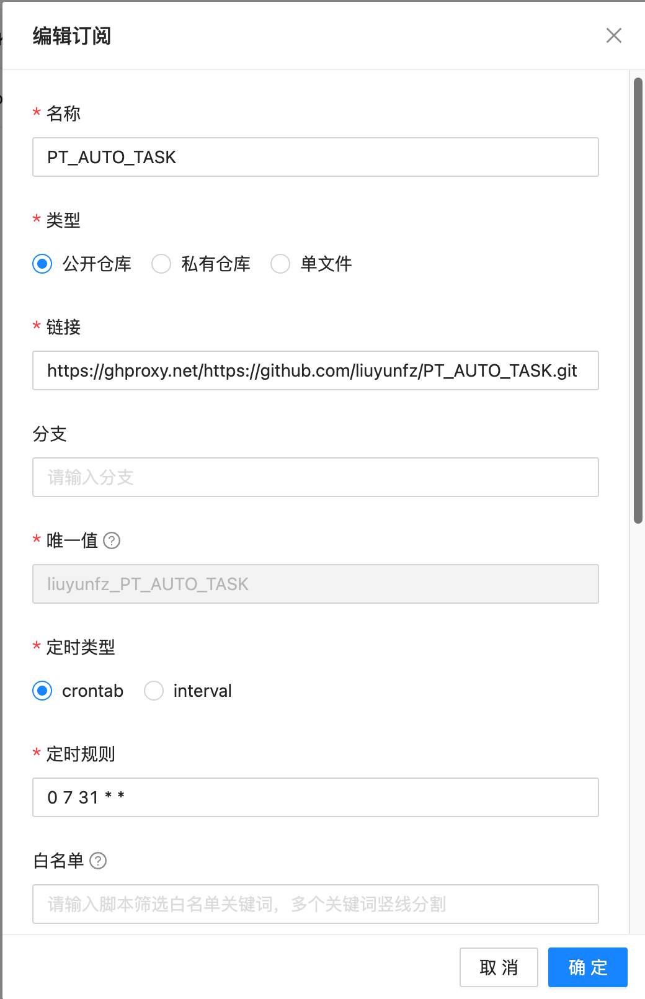
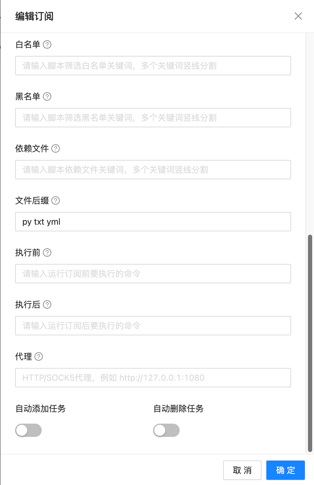
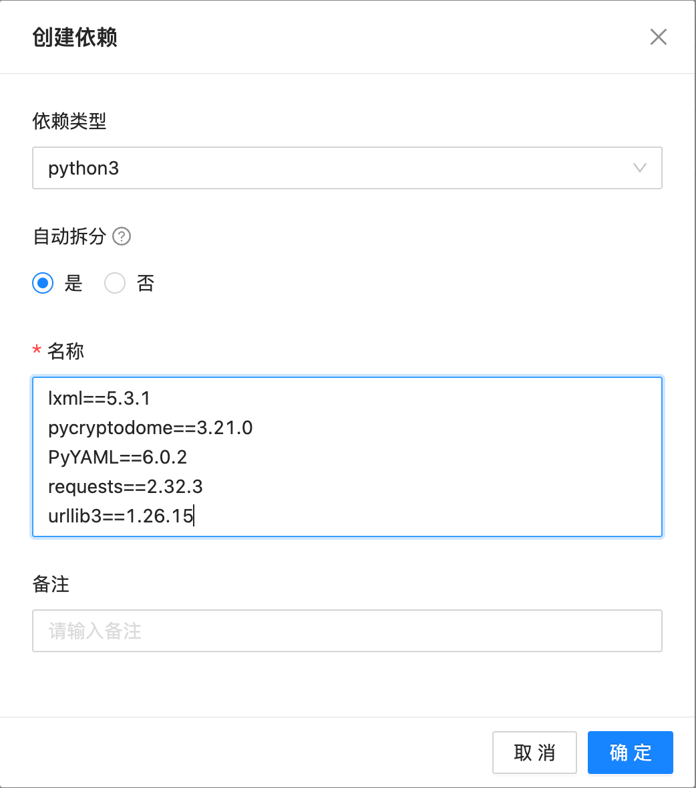
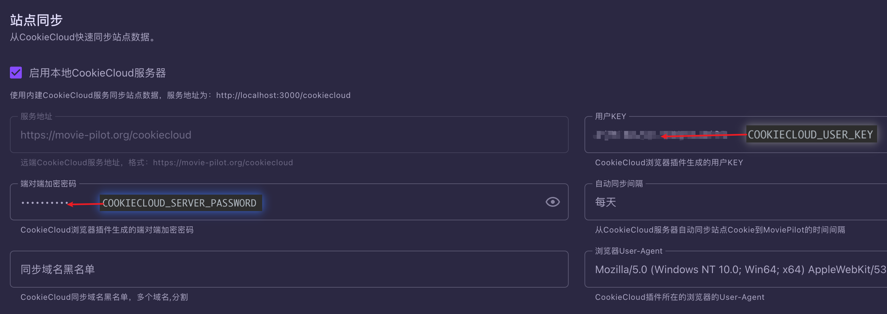
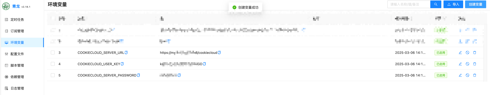
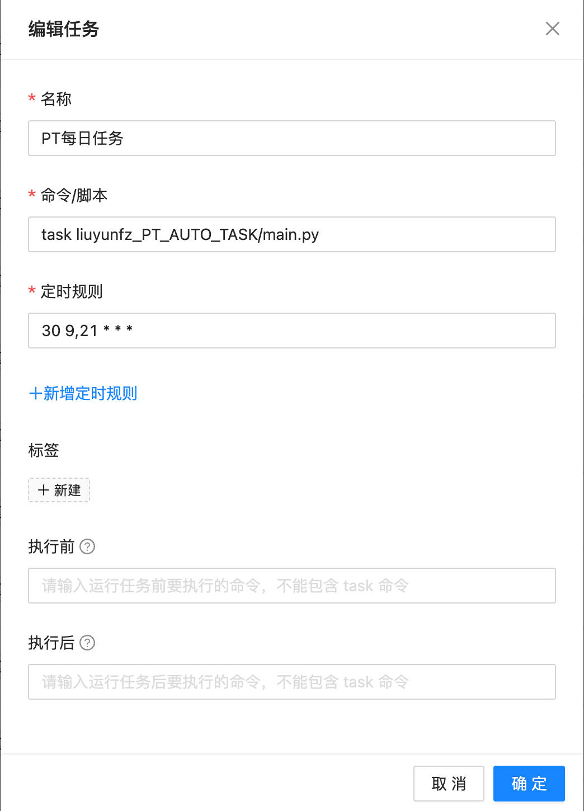
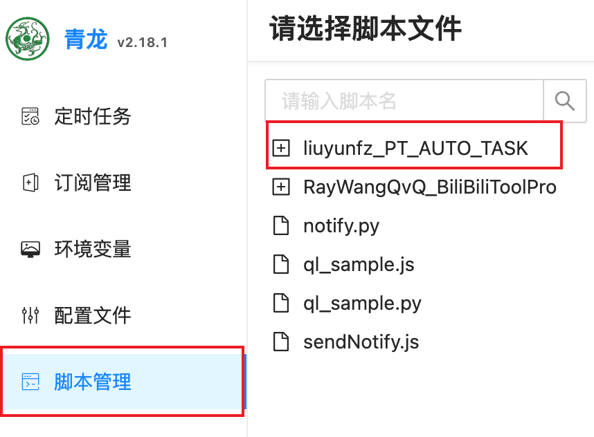

**本文是关于青龙面板的使用方式教程**

## 1. 订阅创建

打开青龙面板到订阅管理页面，创建订阅并手动运行一次，请确保下方的自动添加与自动删除为未选中。

名称：任意，本处使用项目名`PT_AUTO_TASK`

链接：`https://github.com/liuyunfz/PT_AUTO_TASK.git`

> 如果遇到网络错误拉取失败可使用加速版本`https://ghproxy.net/https://github.com/liuyunfz/PT_AUTO_TASK.git`)

定时规则：5位cron表达式，按项目更新需求设置，可参考使用`0 7 */1 * *`

文件后缀：`py txt yml`






## 2. 安装依赖

**打开青龙面板的依赖管理页面，选择Python3，点击右上角创建依赖，将项目中的`requirements.txt`中的文件复制进去，将自动拆分设为是。**

自动拆分：`是`

名称：仅供示例，请**以项目`requirements.txt`中的文件内容为准**

```
lxml==5.3.1
pycryptodome==3.21.0
PyYAML==6.0.2
requests==2.32.3
urllib3==1.26.15
```



## 3. 设置CookieCloud环境变量

打开青龙面板的**环境变量**栏目，在右上角点击创建变量，并填入以下3个相关变量。

```
COOKIECLOUD_SERVER_URL
COOKIECLOUD_USER_KEY
COOKIECLOUD_SERVER_PASSWORD
```

其对应值可在Moviepilot中的 设定-站点-站点同步 中查看

`COOKIECLOUD_SERVER_URL` 为MP对应URL + /cookiecloud





## 4. 创建定时任务

**打开青龙面板的定时任务栏目，右上角点击创建任务。**

名称：随意取名，本处示例为`PT每日任务`

命令/脚本：task + 「脚本目录」+ /main.py 。目录详见图二，本处示例为`task liuyunfz_PT_AUTO_TASK/main.py`

定时规则：5位cron表达式，本处示例为`30 9,21 * * *`





## 5. Enjoy it

到此青龙面板的配置就结束了，你可以手动在定时任务中运行一次。

如果需要通知订阅，只需同其他脚本一样在青龙的**配置文件**中设置对应推送渠道的Key即可